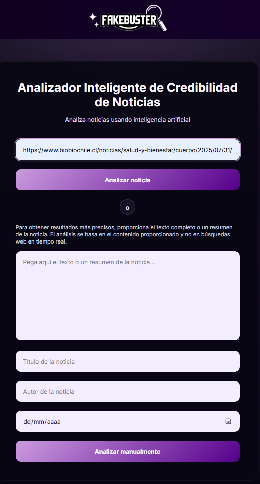
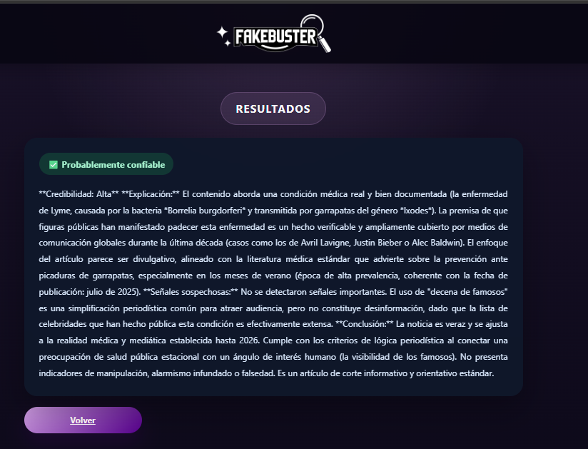

# FakeBuster AI

FakeBuster AI is a Django web application for analyzing the credibility of news articles with Google Gemini. It supports both URL-based analysis and manual article input, and presents the result as a structured credibility assessment.

## Features

- Extracts article title, author, publication date, and content from a URL.
- Uses `newspaper3k` to download and parse articles.
- Handles invalid URLs and sites that block automated access.
- Caches parsed articles during the application process to avoid duplicate downloads.
- Supports manual analysis with a text or summary and a required title.
- Accepts optional author and publication date fields for manual analysis.
- Validates URLs and required manual fields on the server.
- Uses Google GenAI with the `gemini-3.1-flash-lite` model.
- Displays credibility, explanation, suspicious signals, and conclusion sections.
- Provides a loading state while a form is being processed.

## Screenshots





## Technology

| Component | Technology | Version |
| --- | --- | --- |
| Web framework | Django | 6.0.5 |
| AI client | Google GenAI | 1.15.0 |
| AI model | Gemini | `gemini-3.1-flash-lite` |
| Article extraction | newspaper3k | 0.2.8 |
| Environment configuration | python-dotenv | 1.2.2 |
| Frontend | HTML, CSS, and vanilla JavaScript | - |

`lxml_html_clean` is included as a compatibility dependency required by the article extraction stack.

## Requirements

- Python 3.8 or newer
- pip
- A Google AI API key
- A virtual environment is recommended

## Installation

### 1. Clone the repository

```bash
git clone https://github.com/GerardoYael13/FakeBusterAI-Django-Python.git
cd FakeBusterAI-Django-Python
```

### 2. Create and activate a virtual environment

Windows:

```powershell
python -m venv .venv
.\.venv\Scripts\Activate.ps1
```

Linux or macOS:

```bash
python -m venv .venv
source .venv/bin/activate
```

### 3. Install dependencies

```bash
pip install -r requirements.txt
```

### 4. Configure environment variables

Copy `.env.example` to `.env` and set the values for your local environment:

```env
DJANGO_SECRET_KEY=your-secret-key
DJANGO_DEBUG=True
DJANGO_ALLOWED_HOSTS=127.0.0.1,localhost
GOOGLE_API_KEY=your-google-api-key-here
```

Create a Django secret key with:

```bash
python -c "from django.core.management.utils import get_random_secret_key; print(get_random_secret_key())"
```

API keys are available through [Google AI Studio](https://aistudio.google.com/app/apikey). Keep `.env` local and never commit it.

### 5. Apply migrations and start the server

```bash
python manage.py migrate
python manage.py runserver
```

Open `http://127.0.0.1:8000/` in a browser.

## Usage

### URL analysis

1. Enter a valid article URL.
2. Select the URL analysis button.
3. FakeBuster downloads and parses the article.
4. The extracted metadata and content are sent to Gemini for analysis.
5. Review the structured credibility result.

If the website blocks automated access, use manual analysis instead.

### Manual analysis

1. Enter the article content or a summary.
2. Enter the article title.
3. Optionally enter the author and publication date.
4. Submit the manual analysis form.

The content and title are required for manual analysis.

## Project Structure

```text
FakeBusterAI-Django-Python/
├── .env.example
├── FakeBuster/
│   ├── article_extractor.py
│   ├── constants.py
│   ├── gemini_service.py
│   ├── models.py
│   ├── tests.py
│   ├── urls.py
│   ├── utils.py
│   ├── views.py
│   ├── migrations/
│   │   └── __init__.py
│   ├── templates/
│   │   ├── index.html
│   │   └── respuesta.html
│   └── static/
│       ├── css/
│       │   ├── styles.css
│       │   └── results.css
│       ├── img/
│       │   ├── favicon.png
│       │   └── logo.png
│       └── js/
│           └── main.js
├── FakeBusterWeb/
│   ├── settings.py
│   ├── urls.py
│   ├── asgi.py
│   └── wsgi.py
├── Screenshots/
│   ├── home.png
│   └── resultado.png
├── manage.py
├── README.md
└── requirements.txt
```

## Logging

The application uses Python's `logging` configuration in `FakeBusterWeb/settings.py`. FakeBuster events are sent to the console and to a local log file created in the `logs/` directory when the application runs.

Gemini diagnostic messages contain only operational metadata such as response status, candidate count, finish reason, and block reason. They do not include URLs, API keys, or the full article content.

## Testing

Run Django's system checks:

```bash
python manage.py check
```

Run the basic test suite:

```bash
python manage.py test FakeBuster.tests
```

The tests cover article extraction output and the URL and manual input validators.

## Limitations

FakeBuster AI is an experimental analysis tool, not an official fact-checking service. Its result should be treated as an assessment to support further verification, not as a definitive determination of truth.

The URL workflow depends on the target website allowing automated article retrieval. The analysis also depends on the availability and response of the configured Gemini API.

## License

This project was created for academic and learning purposes.

## Credits

Original team:

- @danielisaisal
- @memotas98
- @OzielLM
- @Rogelio-CC
- @GerardoYael13
